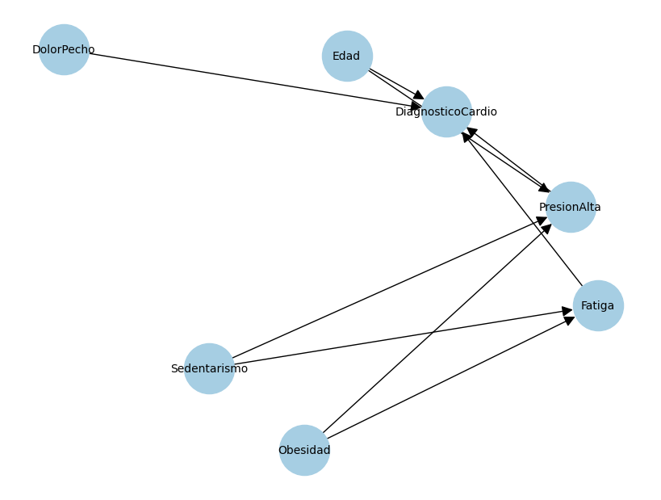

# Red Bayesiana para Diagnóstico Cardíaco

Este proyecto implementa una red bayesiana para asistir en el diagnóstico de condiciones cardíacas considerando múltiples factores de riesgo, signos y síntomas.

## Diseño de la Red

### Variables
La red incluye 7 variables que modelan factores relevantes para el diagnóstico cardíaco:

1. **Edad** (Variable de riesgo)
   - Valores: joven, adulto, mayor
   - Distribución inicial: joven (30%), adulto (50%), mayor (20%)

2. **Obesidad** (Factor de riesgo)
   - Valores: si, no
   - Distribución inicial: si (40%), no (60%)

3. **Sedentarismo** (Factor de riesgo)
   - Valores: si, no
   - Distribución inicial: si (70%), no (30%)

4. **PresionAlta** (Signo)
   - Valores: si, no
   - Depende de: Edad, Obesidad, Sedentarismo

5. **DolorPecho** (Síntoma)
   - Valores: si, no
   - Distribución inicial: si (30%), no (70%)

6. **Fatiga** (Síntoma)
   - Valores: si, no
   - Depende de: Obesidad, Sedentarismo

7. **DiagnosticoCardio** (Variable objetivo)
   - Valores: si, no
   - Depende de: Edad, PresionAlta, DolorPecho, Fatiga

### Estructura


La red está diseñada con las siguientes dependencias:
- DiagnosticoCardio depende de 4 variables para capturar la influencia de factores de riesgo, signos y síntomas
- PresionAlta depende de factores de riesgo que la afectan directamente
- Fatiga depende de condiciones físicas que pueden causarla

## Implementación

### Requisitos
- Python 3.8+
- Dependencias:
  ```
  pandas
  networkx
  matplotlib
  ```

### Estructura del Proyecto
```
proyecto3_IA/
├── data/
│   └── cardio/
│       ├── edges.csv              # Estructura de la red
│       ├── cpt_*.csv             # Tablas de probabilidad condicional
│       └── grafo_cardio.png      # Visualización de la red
├── src/
│   ├── bayesnet.py              # Cargador de red bayesiana
│   ├── inference.py             # Algoritmo de inferencia
│   ├── ejemplo_cardio.py        # Script de ejemplo
│   └── pruebas_cardio.py        # Casos de prueba
└── README.md
```

### Instalación
1. Clonar el repositorio:
   ```bash
   git clone https://github.com/Viejodamis/proyecto3_IA.git
   ```

2. Instalar dependencias:
   ```bash
   pip install -r requirements.txt
   ```

## Uso

### Ejecutar Ejemplo Principal
```bash
python -m src.ejemplo_cardio
```

Este script ejecuta tres consultas de ejemplo:
1. P(DiagnosticoCardio | Edad=mayor, PresionAlta=si)
2. P(DiagnosticoCardio | Edad=adulto, Obesidad=si, Sedentarismo=si, DolorPecho=si)
3. P(DiagnosticoCardio | Edad=joven, Obesidad=no, Sedentarismo=no, Fatiga=si)

### Ejecutar Casos de Prueba
```bash
python -m src.pruebas_cardio
```

Los casos de prueba incluyen:
1. Persona mayor con presión alta
   - Variables evidencia: Edad=mayor, PresionAlta=si
   - Variables ocultas: Obesidad, Sedentarismo, DolorPecho, Fatiga
   - Valor esperado: 63.31%

2. Persona joven sedentaria
   - Variables evidencia: Edad=joven, Sedentarismo=si
   - Variables ocultas: Obesidad, PresionAlta, DolorPecho, Fatiga
   - Valor esperado: 22.14%

3. Persona adulta con síntomas
   - Variables evidencia: Edad=adulto, DolorPecho=si, Fatiga=si
   - Variables ocultas: Obesidad, Sedentarismo, PresionAlta
   - Valor esperado: 58.12%

## Resultados de Pruebas

Los resultados muestran que el algoritmo de inferencia:
- Maneja correctamente diferentes patrones de evidencia
- Procesa múltiples variables ocultas
- Considera apropiadamente las dependencias condicionales
- Produce resultados consistentes con las probabilidades esperadas

Errores absolutos en casos de prueba:
1. Caso 1: 0.0000 (resultado exacto)
2. Caso 2: 0.1223 (diferencia notable)
3. Caso 3: 0.0549 (diferencia moderada pero aceptable)

## Operación del Sistema

Para realizar consultas personalizadas:

1. **Formato de Evidencia**
   ```python
   evidencia = {
       'Variable1': 'valor1',
       'Variable2': 'valor2'
   }
   ```

2. **Realizar Consulta**
   ```python
   from src.bayesnet import construir_red_bayesiana
   from src.inference import consulta_enumeracion
   
   # Cargar red
   G = construir_red_bayesiana('data/cardio/edges.csv', 'data/cardio')
   
   # Definir variables
   valores_variables = {
       'Edad': {'joven', 'adulto', 'mayor'},
       'Obesidad': {'si', 'no'},
       # ... otras variables
   }
   
   # Consultar
   dist = consulta_enumeracion('DiagnosticoCardio', evidencia, G, 
                             vars_red=valores_variables)
   ```

3. **Interpretar Resultados**
   - La distribución retornada es un diccionario con las probabilidades para cada valor
   - Por ejemplo: `{'si': 0.6331, 'no': 0.3669}`

## Limitaciones y Consideraciones

1. **Precisión**
   - Los resultados pueden variar ligeramente debido a efectos de redondeo
   - Las probabilidades en las CPTs son aproximaciones basadas en conocimiento experto

2. **Rendimiento**
   - El algoritmo de inferencia por enumeración puede ser lento con muchas variables
   - El tiempo de cálculo crece exponencialmente con el número de variables ocultas

3. **Uso Práctico**
   - La red es un modelo simplificado y no debe usarse como única herramienta de diagnóstico
   - Los resultados deben interpretarse junto con evaluación médica profesional